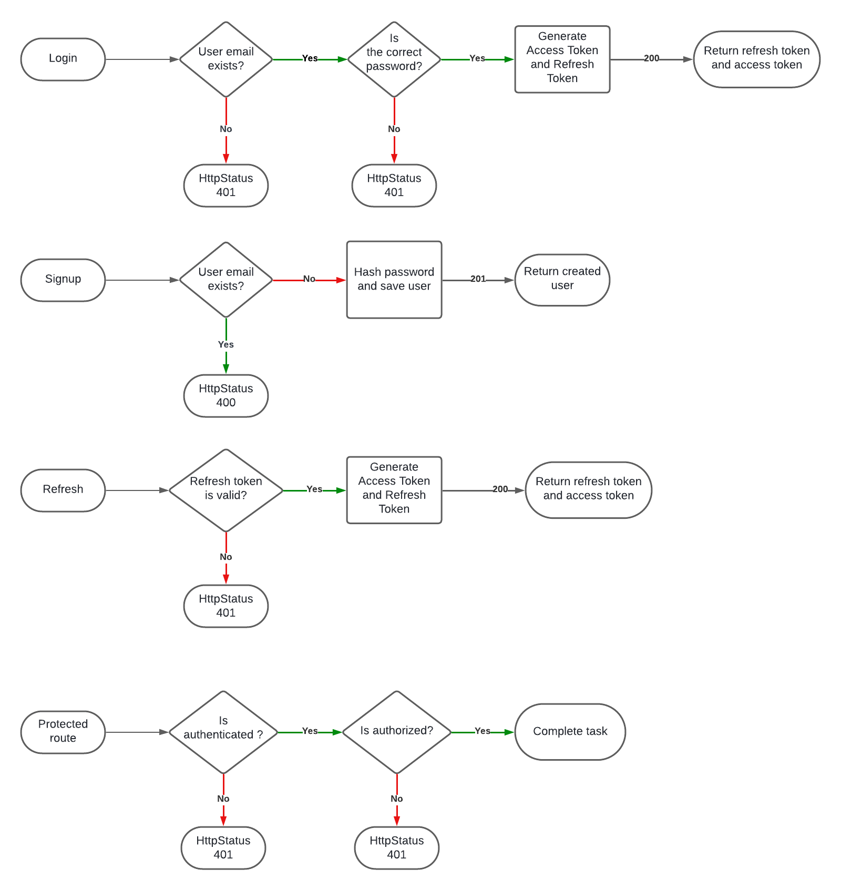
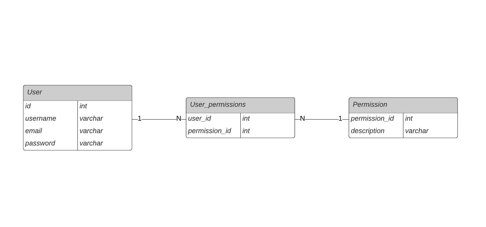

# Spring Boot Refresh Token

An implementation of JWT refresh token authentication using 
spring security and spring boot

## Running The project

### 1. Setup Database with docker

Run on project root folder the fallowing command:
```bash
docker compose up -d
```

This command will start a postgres container on port 5432.

The user is <b>admin</b> and password is <b>admin123</b>, you can change 
this configuration on docker-compose file localized on 
root folder.

You can connect in this database on host with those credentials.

### 2. Run the project

Now you can just run the project using your favourite IDE, or using the 
jdk command line to compile and run the main class.

The first time you initialize the project the docker-compose file will create
a database called "auth_api" and will run the migrations, using flyway, localized
in resources/db/migration.

The application will start in http://localhost:8080

## Api Documentation

### 1. API Endpoints
- POST /auth/login
- POST /auth/signup
- GET /auth/refresh
- GET /admin

You can export the Postman collection with this file 
<a download href="./docs/refresh-token-java.postman_collection.json">Export to postman<a/>.

### 2. API Services


### 3. Entity Relationship Diagram

